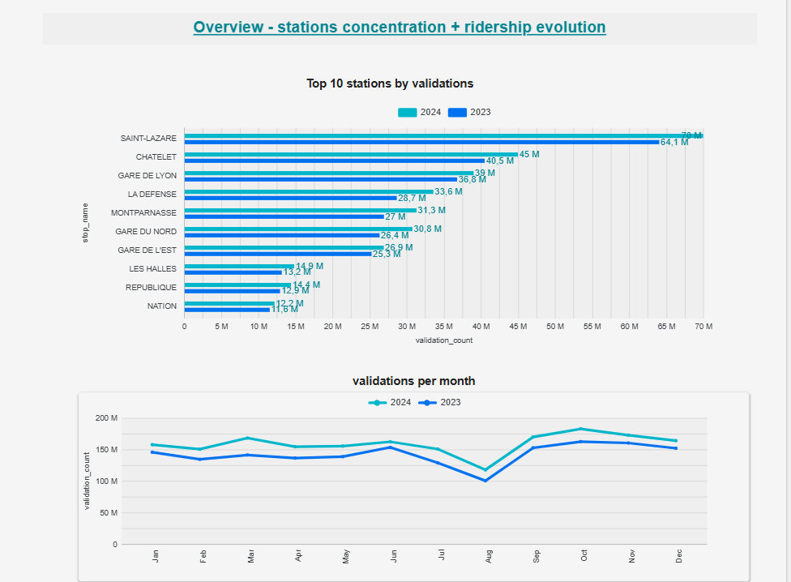
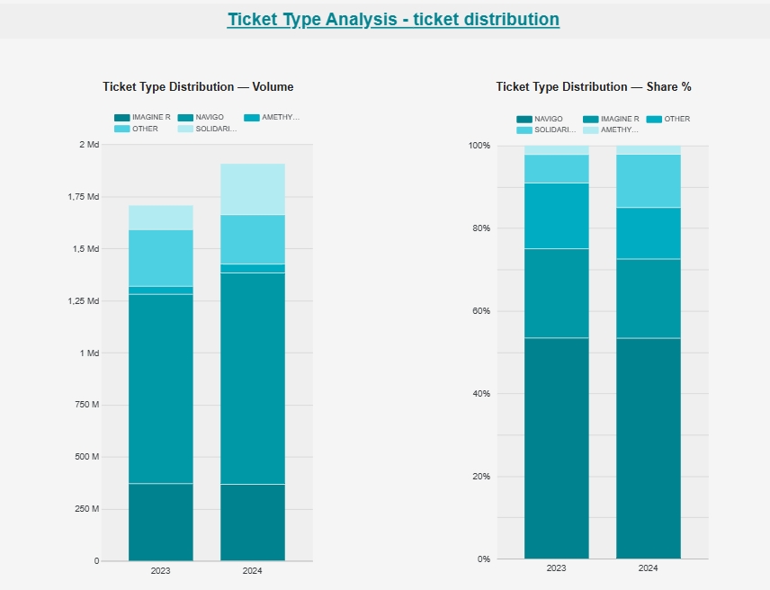
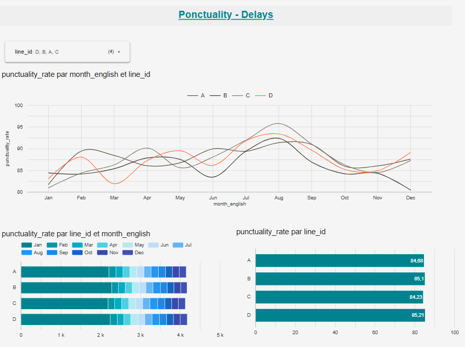
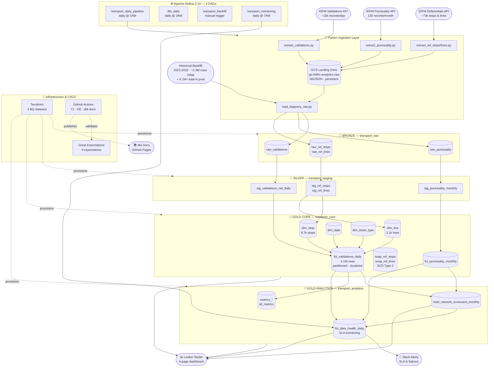

# 🚇 IDFM Analytics DataOps

[](https://python.org)
[](https://getdbt.com)
[](https://airflow.apache.org)
[](https://cloud.google.com/bigquery)
[](https://terraform.io)
[](https://docker.com)
[](https://github.com/elliepsc/idfm-analytics-dataops/actions)
[](https://elliepsc.github.io/idfm-analytics-dataops)

> **Production-grade batch analytics pipeline for Paris public transport (IDFM network)**
> API Ingestion → BigQuery (Medallion) → dbt → Airflow (4 DAGs) → Data Quality → Dashboard

---

## Table of Contents

- [Problem Statement](#-problem-statement)
- [Overview](#-overview)
- [Tech Stack](#-tech-stack)
- [Architecture](#-architecture)
- [Data Pipeline](#-data-pipeline)
- [Historical Backfill](#-historical-backfill)
- [Data Warehouse & dbt Models](#-data-warehouse--dbt-models)
- [Data Quality & Testing](#-data-quality--testing)
- [CI/CD](#-cicd)
- [Dashboard](#-dashboard)
- [Quickstart](#-quickstart)
- [Steps to Reproduce](#-steps-to-reproduce)
- [Dev vs Prod Environments](#-dev-vs-prod-environments)
- [Project Structure](#-project-structure)
- [Architecture Decisions](#-architecture-decisions)

---

## 🎯 Problem Statement

Île-de-France Mobilités (IDFM) operates the densest public transport network in Europe: **~10 million trips per day**, 300+ lines, 5,000+ stops. IDFM publishes open data via REST APIs — ticket validations, train punctuality, stop and line reference data.

These datasets are scattered across heterogeneous APIs, with no consolidation or historization. There is no unified view to answer simple but essential questions:

- Which train lines are chronically late?
- Has punctuality improved or degraded over 6 months?
- Which stations concentrate the most passenger validations?
- Are the data pipelines fresh and meeting SLA targets?

This project builds a **production-grade analytics pipeline** that automatically ingests, transforms, and serves these datasets to answer exactly those questions.

---

## 📌 Overview

This is a complete end-to-end data engineering project that:

1. **Extracts** data daily from IDFM open APIs (validations, punctuality, stops, lines)
2. **Loads** raw data into BigQuery (Bronze layer)
3. **Transforms** with dbt following the Medallion architecture (Bronze → Silver → Gold)
4. **Orchestrates** the full pipeline with Apache Airflow (4 DAGs, daily schedule)
5. **Validates** data quality with dbt tests (95) and Great Expectations (9 expectations, CI)
6. **Provisions** all infrastructure with Terraform (IaC) — 5 prod datasets + 4 dev datasets
7. **Exposes** KPIs in a Looker Studio dashboard

Additionally, a manifest-driven **historical backfill** loaded 2023–2025 data (~2.3M rows) into BigQuery. Combined with daily pipeline ingestion, the fact table now holds 4.1M+ rows with ongoing daily growth.

---

## 🛠️ Tech Stack

| Component | Technology | Role |
|-----------|-----------|------|
| Cloud Platform | Google Cloud Platform | Infrastructure, storage, compute |
| Data Warehouse | BigQuery | Analytical SQL, partitioned tables |
| IaC | Terraform | Reproducible GCP resource provisioning |
| Orchestration | Apache Airflow 2.10 | DAG scheduling, retry, alerting |
| Transformation | dbt-bigquery 1.8.7 | SQL models, tests, documentation |
| Containerization | Docker Compose | Local Airflow environment |
| Data Quality | Great Expectations | CI-integrated validation suite |
| CI/CD | GitHub Actions | Lint, test, dbt docs on every push |
| Visualization | Looker Studio | Interactive dashboard |
| Language | Python 3.12 | Ingestion, backfill, tests |

---

## 🏗️ Architecture

```
┌──────────────────────────────────────────────────────────────────┐
│                         IDFM APIs                                │
│   API Validations · API Ponctualité · API Référentiels           │
│   + Historical backfill (2023–2025, ~2.3M rows initial)          │
└─────────────────────┬────────────────────────────────────────────┘
                      │ Python (stream to memory — no local disk)
                      ▼
┌──────────────────────────────────────────────────────────────────┐
│           LANDING ZONE — GCS (persistent, auditable)             │
│         gs://idfm-analytics-raw/  (NDJSON, append-only)          │
│   validations/ · punctuality/ · referentials/                    │
└─────────────────────┬────────────────────────────────────────────┘
                      │ load_table_from_uri (BigQuery native)
                      ▼
┌──────────────────────────────────────────────────────────────────┐
│               BRONZE — Raw Layer                                 │
│                  BigQuery: transport_raw                         │
│   raw_validations · raw_punctuality · raw_ref_stops/lines        │
└─────────────────────┬────────────────────────────────────────────┘
                      │ dbt staging models
                      ▼
┌──────────────────────────────────────────────────────────────────┐
│              SILVER — Staging Layer                              │
│            BigQuery: transport_staging                          │
│      stg_validations · stg_punctuality · stg_ref_stops/lines     │
└─────────────────────┬────────────────────────────────────────────┘
                      │ dbt core + marts models
                      ▼
┌──────────────────────────────────────────────────────────────────┐
│               GOLD — Analytics Layer                             │
│     BigQuery: transport_core · transport_analytics              │
│   dim_stop · dim_line · dim_date · dim_ticket_type               │
│   fct_validations_daily (partitioned by date · clustered)        │
│   fct_punctuality_monthly · mart_network_scorecard_monthly       │
│   fct_data_health_daily (SLA monitoring) · metrics_* · all_metrics│
└─────────────────────┬────────────────────────────────────────────┘
                      │
         ┌────────────┴────────────┐
         ▼                         ▼
  Looker Studio              dbt Docs
   Dashboard              (GitHub Pages)
```

### Why Medallion Architecture?

| Layer | Role | Key Benefit |
|-------|------|-------------|
| **Bronze (Raw)** | Immutable source data, never modified | Full audit trail — always reprocessable |
| **Silver (Staging)** | Cleaning, typing, column renaming | Source changes don't cascade to analytics |
| **Gold (Marts)** | Business aggregations, KPIs, metrics | BI-ready, pre-computed, fully tested |


---

## 🔄 Data Pipeline

### Batch Strategy

This project uses a **daily batch architecture** — the right choice for IDFM data because:
- Validation data is published by IDFM with a 24h delay (not real-time)
- Punctuality data is aggregated monthly at source
- Daily grain is sufficient for trend analysis and operational reporting

The pipeline runs at **2 AM daily** to ensure previous day's data is available. Each run is idempotent: `WRITE_TRUNCATE` on raw tables + incremental `MERGE` on fact tables means re-running never creates duplicates.

### Ingestion Layer

| Script | Source | Volume | Strategy |
|--------|--------|--------|---------|
| `extract_validations.py` | IDFM Validations API | ~15k records/day | Paginated GET → stream NDJSON → GCS |
| `extract_punctuality.py` | Transilien Punctuality API | 156 records/month | Full monthly extract → GCS |
| `extract_ref_stops.py` | IDFM Stops API | ~73k records | Full refresh → GCS |
| `extract_ref_lines.py` | IDFM Lines API | ~2100 lines | Full refresh → GCS |
| `load_bigquery_raw.py` | GCS (`gs://idfm-analytics-raw/`) | All above | `load_table_from_uri` → BigQuery RAW |

### DAG 1: `transport_daily_pipeline`
**Schedule**: daily at 2 AM · **Average duration**: ~3 min

```
extract_validations  ─┐
extract_punctuality   ─┼──► load_bigquery_raw ──► dbt_build ──► check_sla ──► notify_success
extract_referentials  ─┘
      (parallel)                                   (sequential)
```

| Task | Operator | Description |
|------|----------|-------------|
| `extract_validations` | PythonOperator | Fetch ticket validations from IDFM API → stream NDJSON → GCS |
| `extract_punctuality` | PythonOperator | Fetch Transilien punctuality data → stream NDJSON → GCS |
| `extract_referentials` | PythonOperator | Fetch stops and lines reference data → stream NDJSON → GCS |
| `load_bigquery_raw` | PythonOperator | GCS → BigQuery RAW via `load_table_from_uri` |
| `dbt_deps` | BashOperator | Install dbt packages before the build step |
| `dbt_build` | BashOperator | Run dbt models + tests after dependencies are installed |
| `verify_row_counts` | PythonOperator | Blocking guard that fails early if critical tables are empty |
| `check_sla` | PythonOperator | Freshness + quality via `fct_data_health_daily` |
| `notify_success` | PythonOperator | Slack alert on success (silent if unconfigured) |

### DAG 2: `dbt_daily`
**Schedule**: daily at 3 AM. dbt transformations only, no ingestion.

Tasks: `dbt_deps` → `dbt_run_staging` → `dbt_run_core` → `dbt_run_marts` → `dbt_test` → `dbt_docs_generate` → `notify_success`

### DAG 3: `transport_backfill`
**Schedule**: manual trigger. Historical data reload over a configurable date range.

### DAG 4: `transport_monitoring`
**Schedule**: daily at 7 AM. BigQuery freshness checks, volume threshold alerts (>20% drop), SLA checks. Results written to `fct_data_health_daily`.

### Error Handling
- **Retries**: 3 attempts with 5-min delay
- **Timeout**: 4h max per run (`extract_referentials` fetches ~73k records)
- **Alerting**: Slack webhook on failure (graceful skip if unconfigured)
- **Monitoring**: `fct_data_health_daily` tracks freshness and SLA compliance per table

---

## 🗃️ Historical Backfill

A **manifest-driven backfill module** loaded 2023–2025 historical data into BigQuery on project initialization, giving the dashboard multi-year trends from day one.

### Data Loaded

| Period | Rows | Source Strategy |
|--------|------|----------------|
| 2023 S1 (Jan–Jun) | ~400k | Dynamic ZIP URL — resolved from IDFM catalog API at runtime |
| 2023 S2 (Jul–Dec) | ~400k | Dynamic ZIP URL — resolved from IDFM catalog API at runtime |
| 2024 S1 (Jan–Jun) | ~400k | Dynamic ZIP URL — resolved from IDFM catalog API at runtime |
| 2024 T3 (Jul–Sep) | ~400k | Dynamic ZIP URL — resolved from IDFM catalog API at runtime |
| 2024 T4 (Oct–Dec) | 469k | Public GCS snapshot (`gs://idfm-backfill-sources`) |
| 2025 recent | 477k | Direct CSV from IDFM rolling dataset |
| **Total** | **~2.3M** | Backfill initial — `fct_validations_daily` now at **4.1M+** rows via daily pipeline |

### Key Design Decisions

**Dynamic URL resolution**: IDFM ZIP file hashes change when they update their data. Rather than hardcoding URLs, the backfill queries the IDFM catalog API at runtime to always resolve the current download URL for each year.

**GCS public archive for T4 2024**: The original IDFM URL for T4 2024 is a rolling dataset that now serves 2025 data. The snapshot was archived in a public GCS bucket so anyone cloning the repo can reproduce the exact same BigQuery state without any manual steps.

**MERGE strategy (idempotent)**: Staging + MERGE on the natural key `(date, stop_id, ticket_type)`. Re-running on already-loaded data inserts 0 rows — safe to replay at any time.

```bash
# Dry-run first — parse all files, no BigQuery writes
python ingestion/backfill/run_backfill.py --dry-run

# Full backfill (~2.3M rows initial, ~10 min)
python ingestion/backfill/run_backfill.py --base-dir "/path/to/downloads"

# Single period
python ingestion/backfill/run_backfill.py --period 2024-T4 --force
```

---

## 🔧 Data Warehouse & dbt Models

### BigQuery Datasets

| Dataset | Layer | Environment | Content |
|---------|-------|-------------|---------|
| `transport_raw` | Bronze | Prod | Raw data from APIs and backfill |
| `transport_staging` | Silver | Prod | Cleaned, typed, renamed views |
| `transport_core` | Gold | Prod | Dimensions + Facts (Airflow writes here) |
| `transport_analytics` | Gold | Prod | Marts + Metrics (Looker Studio source) |
| `transport_snapshots` | — | Prod | SCD Type 2 historization |
| `transport_dev_*` | All layers | Dev | Local development only — see Dev/Prod section |

All datasets are provisioned and managed by Terraform (`terraform/bigquery.tf`).

### 17 dbt Models

```
warehouse/dbt/models/
│
├── staging/                              # SILVER — 1:1 with source tables
│   ├── stg_validations_rail_daily.sql    # Clean + normalize raw validations (incl. stop_name)
│   ├── stg_punctuality_monthly.sql       # Clean + normalize punctuality
│   ├── stg_ref_stops.sql                 # Normalize stop reference
│   ├── stg_ref_lines.sql                 # Normalize line reference
│   └── stg_ref_stop_lines.sql            # Stop ↔ Line mapping
│
├── core/                                 # GOLD — Dimensional model (Kimball)
│   ├── dim_stop.sql                      # Stop dimension (8,500 stops)
│   ├── dim_line.sql                      # Line dimension (2,100 lines)
│   ├── dim_date.sql                      # Date dimension
│   ├── dim_ticket_type.sql               # Ticket category dimension
│   ├── fct_validations_daily.sql         # ★ Main fact table — incremental
│   │                                     #   4.1M rows · stop_name included
│   │                                     #   partitioned by validation_date (DAY)
│   │                                     #   clustered by stop_id, ticket_type
│   └── fct_punctuality_monthly.sql       # Punctuality fact — incremental
│
└── marts/                                # GOLD — Pre-computed analytics
    ├── fct_data_health_daily.sql         # SLA monitoring (5 SLA columns)
    ├── mart_network_scorecard_monthly.sql # Executive KPI scorecard
    ├── metrics_fct_validations_daily.sql
    ├── metrics_fct_punctuality_monthly.sql
    ├── metrics_mart_network_scorecard_monthly.sql
    └── all_metrics.sql                   # Consolidated KPI view (dashboard source)

warehouse/dbt/snapshots/
├── snap_ref_stops.sql                    # SCD Type 2 — stop historization
└── snap_ref_lines.sql                    # SCD Type 2 — line historization
```

### Materialization Strategy

| Model | Type | Reason |
|-------|------|--------|
| `stg_*` | View | Lightweight, recomputed on demand |
| `dim_*` | Table | Stable reference, frequent joins |
| `fct_validations_daily` | Incremental | ~15k rows/day, append-only pattern |
| `fct_punctuality_monthly` | Incremental | Monthly data — ⚠️ `insert_overwrite` replaces full partition. SNCF retroactive corrections require `make dbt-refresh-prod MODEL=fct_punctuality_monthly`. See `schema.yml` for full procedure. |
| `mart_*`, `metrics_*` | Table | Expensive aggregations, pre-computed |
| `snap_*` | Snapshot | SCD Type 2 — tracks reference changes over time |

### Partitioning & Clustering

`fct_validations_daily` is **partitioned by `validation_date` (DAY)** and **clustered by `stop_id, ticket_type`**.

This directly optimizes the most common query patterns:
- Date-range filters (`WHERE validation_date BETWEEN ...`) skip irrelevant partitions entirely
- Aggregations by station or ticket category (`GROUP BY stop_id`) benefit from clustering
- At 4.1M+ rows, this reduces bytes scanned and dashboard query costs significantly

### dbt Test Results

```
✅ 95 PASS   ⚠️ 3 WARN   ❌ 0 ERROR
```

| Test Type | Severity | Examples |
|-----------|----------|---------|
| `not_null` | ERROR | IDs, dates, counts, stop_name |
| `unique` | WARN | Primary keys (known source duplicates) |
| `accepted_values` | ERROR | Ticket categories, risk levels, SLA labels |
| `relationships` | WARN | Orphan FKs — line codes misaligned at source |
| `assert_positive_values` | ERROR | `validation_count > 0` (custom macro) |
| `assert_valid_date_range` | ERROR | `date >= 2020-01-01` (custom macro) |

> The 3 warnings are **source data quality issues** — line codes in validations don't always match the reference dataset, and punctuality keys have known duplicates at source. `severity: warn` monitors without blocking the pipeline.

### SLA Monitoring — `fct_data_health_daily`

The monitoring table tracks 5 SLA dimensions per pipeline table per day:

| Column | Description |
|--------|-------------|
| `sla_met` | Boolean — did the table meet its freshness SLA? |
| `sla_numeric` | INT (1=met, 0=breached) — for Looker Studio numeric filters |
| `sla_status_label` | OK / WARNING / CRITICAL |
| `freshness_delta` | `freshness_hours - sla_hours` — how far above/below SLA |
| `freshness_ratio` | `freshness_hours / sla_hours` — normalized SLA score |

---

## 🧪 Data Quality & Testing

### 1. dbt Tests (95 tests)
Run at every `dbt build`. Blocking (ERROR) on critical issues, non-blocking (WARN) on known source anomalies. Custom generic tests in `macros/`: `test_assert_positive_values.sql`, `test_assert_valid_date_range.sql`.

### 2. Great Expectations (CI-integrated)
9 expectations on `raw_validations`, executed on every push via `data-quality.yml`:

| Expectation | Constraint |
|-------------|-----------|
| `validation_count` | between 0 and 1,000,000 |
| `date` | not null |
| `stop_id` | not null |
| `line_code_trns` | not null |
| `ticket_type` | in expected value set |
| Column types | conformant to schema |

### 3. Python Unit Tests (pytest)
`tests/unit/` — covers extraction scripts and transformation logic. Run via `make test` or `lint-and-test.yml`.

### 4. Monitoring DAG
Daily freshness checks, row count thresholds, SLA compliance. Results in `fct_data_health_daily`.

---

## 🚀 CI/CD

```
Push / PR → GitHub Actions
              ├── lint-and-test.yml    Black · isort · pytest
              ├── data-quality.yml     Great Expectations
              └── dbt-docs.yml         dbt docs → GitHub Pages (main only)
```

| Workflow | Trigger | Jobs |
|----------|---------|------|
| `lint-and-test.yml` | push, PR | Black, isort, pytest |
| `data-quality.yml` | push, PR | Great Expectations on raw_validations |
| `dbt-docs.yml` | push to main | dbt docs generate → GitHub Pages |

> **Note**: Workflows currently run dbt in dry-run mode (no real BigQuery connection in CI). Workload Identity Federation (WIF) configuration is planned to enable real BigQuery validation in CI.

dbt documentation with full lineage DAG: https://elliepsc.github.io/idfm-analytics-dataops

---

## 📊 Dashboard

> 🔗 **[Looker Studio Dashboard](https://lookerstudio.google.com/reporting/153588f1-5147-4a92-8a81-f74c7dec8bf4)**

4-page interactive dashboard built on BigQuery Gold layer tables. All sources point to `transport_core` and `transport_analytics`.

| Page | Title | Key questions answered |
|------|-------|----------------------|
| **1** | Ridership Overview | Which stations concentrate the most validations? How has ridership evolved 2023 vs 2024? |
| **2** | Ticket Type Analysis | Which ticket types drive ridership? How does the mix change year over year? |
| **3** | Punctuality Analysis | Which Transilien lines are chronically late? Has punctuality improved over 2024? |
| **4** | Data Health — SLA Pipeline | Are all pipeline tables fresh and meeting SLA targets? |

Sources: `fct_validations_daily` (4.1M rows, 2023–2025, incl. `stop_name`) · `fct_punctuality_monthly` (12 Transilien lines, 2024) · `fct_data_health_daily`

## Dashboard

Interactive dashboard: [Open in Looker Studio](https://lookerstudio.google.com/reporting/153588f1-5147-4a92-8a81-f74c7dec8bf4)

## Preview

[](https://lookerstudio.google.com/reporting/153588f1-5147-4a92-8a81-f74c7dec8bf4)
[](https://lookerstudio.google.com/reporting/153588f1-5147-4a92-8a81-f74c7dec8bf4)
[](https://lookerstudio.google.com/reporting/153588f1-5147-4a92-8a81-f74c7dec8bf4)

---

## Quickstart

Start with [QUICKSTART.md](QUICKSTART.md) if you want the shortest supported path.

It gives you:

- a reviewer path in a handful of commands
- the exact `terraform init / import / apply` decision rule
- the single source of truth for Airflow UI port and credentials
- the common failures that blocked reproduction attempts

## 🔁 Steps to Reproduce

### Prerequisites
- Docker Desktop
- Google Cloud account with BigQuery enabled
- gcloud CLI installed and authenticated
- IDFM API token ([register here](https://data.iledefrance-mobilites.fr))
- Linux/macOS shell or WSL2 on Windows for the documented `make` and Bash commands

### 1. Clone

```bash
git clone https://github.com/elliepsc/idfm-analytics-dataops.git
cd idfm-analytics-dataops
```

### 2. Configure environment

```bash
cp .env.example .env
# Fill in GCP_PROJECT_ID and IDFM_API_KEY
# ADC only: do not add GOOGLE_APPLICATION_CREDENTIALS
```

### 3. Authenticate GCP

```bash
gcloud auth application-default login
chmod o+r ~/.config/gcloud/application_default_credentials.json
```

### 4. Provision infrastructure

BigQuery datasets are managed by Terraform. If this is a fresh clone with no existing datasets:

```bash
cd terraform
terraform init
terraform apply
cd ..
```

If datasets already exist in your BigQuery project (e.g. you previously ran the pipeline), import them into Terraform state before applying:

```bash
cd terraform
terraform init

# Import existing datasets into Terraform state
terraform import google_bigquery_dataset.transport_raw YOUR_PROJECT_ID/transport_raw
terraform import google_bigquery_dataset.transport_snapshots YOUR_PROJECT_ID/transport_snapshots
terraform import google_bigquery_dataset.transport_staging YOUR_PROJECT_ID/transport_staging
terraform import google_bigquery_dataset.transport_core YOUR_PROJECT_ID/transport_core
terraform import google_bigquery_dataset.transport_analytics YOUR_PROJECT_ID/transport_analytics

# Then apply to sync labels and descriptions
terraform apply
cd ..
```

### 5. Load environment variables

The project uses a `.env` file for all configuration. An alias is available to load it:

```bash
# Add to ~/.bashrc for persistent use across sessions:
alias load-idfm-env='set -a && . /path/to/idfm-analytics-dataops/.env && set +a'

# Then load:
load-idfm-env
```

> `set -a` automatically exports all variables defined in `.env` as environment variables. `set +a` restores normal behaviour after loading.

### 6. Start Airflow

```bash
make airflow-start
# UI port comes from AIRFLOW_HOST_PORT in .env (default: http://localhost:8081)
```

No Airflow UI variables are required for the happy path. The containers read the root `.env` directly.
Default login is `airflow / airflow` unless you override `_AIRFLOW_WWW_USER_USERNAME` and `_AIRFLOW_WWW_USER_PASSWORD` in `.env`.

### 7. Run historical backfill

```bash
source venv/bin/activate

# Validate first (no BQ writes)
python ingestion/backfill/run_backfill.py --dry-run

# Load all periods (~2.3M rows initial)
python ingestion/backfill/run_backfill.py --base-dir "/path/to/downloads"
```

> T4 2024 is archived in a public GCS bucket and downloaded automatically.

### 8. Run dbt

```bash
cd warehouse/dbt
load-idfm-env
dbt deps
dbt build --target prod
```

### 9. Trigger the pipeline

Enable and trigger `transport_daily_pipeline` in the Airflow UI at the URL configured by `AIRFLOW_HOST_PORT` in `.env` (default: `http://localhost:8081`).

---

## 🔀 Dev vs Prod Environments

This project separates development (local WSL) and production (Airflow DAGs) using dbt targets and distinct BigQuery dataset namespaces.

### Dataset naming convention

| Environment | Base dataset | Example dbt output |
|-------------|-------------|-------------------|
| **Prod** | `transport` | `transport_core`, `transport_analytics` |
| **Dev** | `transport_dev` | `transport_dev_core`, `transport_dev_analytics` |

### profiles.yml

```yaml
transport:
  target: dev
  outputs:
    dev:
      type: bigquery
      method: oauth
      project: "{{ env_var('GCP_PROJECT_ID') }}"
      dataset: transport_dev   # writes to transport_dev_*
      threads: 4
      location: europe-west1

    prod:
      type: bigquery
      method: oauth
      project: "{{ env_var('GCP_PROJECT_ID') }}"
      dataset: "{{ env_var('BQ_DATASET_BASE', 'transport') }}"
      location: europe-west1
      threads: 8
```

### Key rules

- **Never run `dbt --target prod` from WSL** for full-refresh operations — always use the Airflow container to ensure writes go to the correct prod datasets.
- **Full-refresh from the Airflow container**: `make dbt-refresh-prod MODEL=model_name`
- **GCP authentication**: always ADC (`gcloud auth application-default login`) — never JSON service account keys.

---

## 📁 Project Structure

```
idfm-analytics-dataops/
│
├── ingestion/                         # Extract & Load
│   ├── odsv2_client.py                # Opendatasoft API client (pagination, retry)
│   ├── extract_validations.py         # Daily ticket validation ingestion
│   ├── extract_punctuality.py         # Monthly punctuality ingestion
│   ├── extract_ref_stops.py           # Stop reference ingestion
│   ├── extract_ref_lines.py           # Line reference ingestion
│   ├── load_bigquery_raw.py           # JSON → BigQuery RAW loader
│   └── backfill/                      # Historical backfill (2023–2025)
│       ├── run_backfill.py            # Manifest-driven orchestrator
│       ├── load_backfill_bq.py        # Staging + MERGE strategy (idempotent)
│       ├── parse_csv_historical.py    # Multi-format CSV parser (5 encoding variants)
│       └── backfill_sources.yml       # Manifest: sources, URLs, loaded status
│
├── warehouse/
│   └── dbt/                           # Transform
│       ├── models/
│       │   ├── staging/               # Silver — 5 models
│       │   ├── core/                  # Gold — 6 models (dims + facts)
│       │   └── marts/                 # Gold — 6 models (aggregations + metrics)
│       ├── snapshots/                 # SCD Type 2 (stops, lines)
│       ├── macros/                    # Custom generic tests
│       ├── seeds/                     # ticket_type_mapping.csv
│       ├── profiles.yml               # Dev/prod targets
│       └── dbt_project.yml
│
├── orchestration/
│   └── airflow/                       # Orchestrate
│       ├── dags/
│       │   ├── transport_daily_pipeline.py   # Main DAG (daily, 7 tasks)
│       │   ├── dbt_daily.py                  # dbt-only DAG
│       │   ├── transport_backfill.py         # Manual backfill DAG
│       │   ├── monitoring_dag.py             # Monitoring DAG
│       │   └── utils/monitoring.py           # SLA callbacks, BQ metrics
│       └── docker-compose.yml
│
├── terraform/                         # Infrastructure as Code
│   ├── main.tf                        # GCP provider config
│   ├── bigquery.tf                    # 9 BigQuery datasets (5 prod + 4 dev)
│   ├── outputs.tf                     # Dataset ID outputs
│   └── variables.tf                   # Project ID, location, labels
│
├── tests/
│   ├── unit/                          # pytest
│   └── data_quality/                  # Great Expectations suite
│
├── .github/workflows/
│   ├── lint-and-test.yml              # Black, isort, pytest
│   ├── data-quality.yml               # Great Expectations
│   └── dbt-docs.yml                   # dbt docs → GitHub Pages
│
├── Makefile                           # Developer commands (make help)
├── .env.example
└── README.md
```


### Mermaid architecture diagram


---

## 🏛️ Architecture Decisions

**Why dbt over raw SQL?**
Versioning, tests, documentation, and dependency management built-in. A blocking `dbt test` before every deploy prevents shipping corrupt data to production.

**Why Airflow over a cron job?**
Dependency graph visibility, automatic retry with backoff, date-range backfill, and Slack alerting. A pipeline that fails silently is worse than no pipeline.

**Why BigQuery over Postgres?**
Native analytical SQL, serverless scaling, and a coherent GCP ecosystem. Free tier covers this project entirely.

**Why partition + cluster `fct_validations_daily`?**
At 4.1M+ rows, partitioning by `validation_date` (DAY) eliminates irrelevant partitions on date-range queries. Clustering by `stop_id, ticket_type` reduces bytes scanned for the most common aggregation patterns — directly improving dashboard performance and cost.

**Why ADC over a service account key?**
More secure (no JSON file to store), GCP-recommended, and key creation was blocked by the org policy anyway.

**Why GCS as landing zone before BigQuery?**
Streaming API responses directly to GCS (in memory, no local disk) gives a persistent, auditable archive of raw files. The worker disk is ephemeral — a pod restart destroys it. GCS blobs are immutable and replayable: if BigQuery needs to be rebuilt, `load_table_from_uri` replays any date from GCS without re-calling the API. This is the standard data platform pattern for decoupling extraction from loading.

**Why MERGE for the backfill?**
Idempotency: re-running inserts 0 rows on already-loaded data. Safe to replay for full reproducibility.

**Why a public GCS bucket for T4 2024?**
The original IDFM URL is a rolling dataset now serving 2025 data. The GCS archive ensures full reproducibility for anyone cloning the repo.

**Why `severity: warn` on relationship tests?**
Line codes in validations don't match the reference dataset at source. Blocking on a source issue would be counterproductive — `warn` monitors without blocking.

**Why separate prod and dev datasets in BigQuery?**
Prevents accidental writes to production tables during local development. The dev datasets (`transport_dev_*`) are identical in structure to prod but isolated — dbt `--target dev` writes there, Airflow always uses `--target prod`.

**Why Terraform import instead of recreate?**
BigQuery datasets created outside of Terraform (by dbt or manually) already contain data. Deleting and recreating them would lose all tables. `terraform import` adopts existing resources into the Terraform state without touching their contents.

---

## 📬 Contact

- GitHub: [@elliepsc](https://github.com/elliepsc)
- Project: [idfm-analytics-dataops](https://github.com/elliepsc/idfm-analytics-dataops)

---

*Developed as part of the [DataTalks.Club Data Engineering Zoomcamp](https://github.com/DataTalksClub/data-engineering-zoomcamp) — March 2026*
